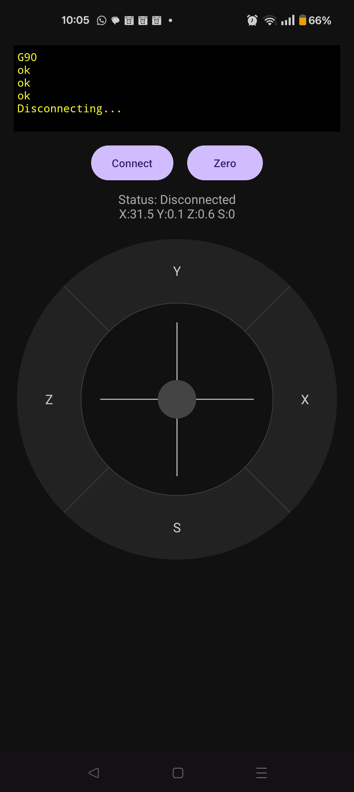

# Simple CNC jogger for Android.

Drag clockwise or anticlockwise from x, y, z, or s (spindle speed) to jog that axis forward or backward, 
drag faster for coarse control and slower for fine control. Use the joystick in the middle for x-y dragging.

Jog-dial works, spindle probably works, but I've disconnected mine while I play with using it as a plotter.

I mainly wanted this so I could use my (cheap) CNC as a drill press without hauling out my laptop.

## Bugs:
* Central joystick should control x-y plane, but isn't wired up currently.
* Jogging is a bit uneven when I'm using it in a floating window - probably the vibe coding made some assumptions.

## Planned improvements:
* Long-press or double-tap jog-dial segments to flip fine/coarse control
* Flip joystick axes
* Long-press or double-tap joystick to flip fine/coarse control
* Rotate joystick axes for operating it from strange angles
* Assume only available serial device - list of one arose from debugging
* More information from serial device(s) if they have names and things
* Use device's idea of x/y/z
  
